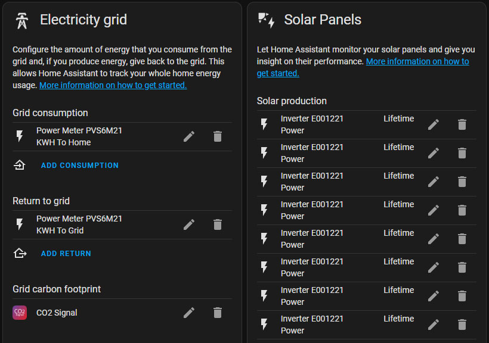
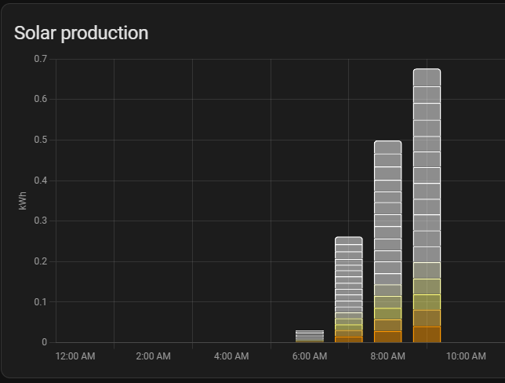

# hass-sunpower
Home Assistant SunPower Integration using the local installer ethernet interface.

[![GitHub Release][releases-shield]][releases]
[![GitHub Activity][commits-shield]][commits]

![Project Maintenance][maintenance-shield]

## Component to integrate with [sunpower][sunpower-us] PVS 5/6 monitors

**This component will set up the following platforms.**

Platform | Description
-- | --
`binary_sensor` | Working/Not Working status for each device.
`sensor` | Most data available from the PVS system including per-panel data.

## Installation
1. Click install.
3. Install HACS
4. Add this Repo to HACS by going to the 3 dots on the right ...-> Custom repositories -> Rpository: krbaker/hass-sunpower Category: integration
5. Install this integration in HACS
6. Restart Home Assistant
8. In the Home Assistant UI go to "Configuration" -> "Integrations" click "+" and search for "Sunpower".
   * The main configuration is IP/Hostname. If setup with a NAT as described below the IP will be 172.27.153.1. Note the network setup is for most people the challenging setup of this integration.
   * Requires that the management LAN interface is plugged in, your installer uses this for setup but doesn't plug it into your lan
   * This network interface has a DHCP server running on it. If you plug it straight into your home network it will make probably other systems stop working as they will DHCP to the wrong address.

## Use descriptive entity names
When selected during installation, entities added for each device will have the device descriptor added onto the front of their name. The device descriptor is a combination of device type (e.g., Inverter) and serial number. This guarantees unique entity IDs and names at the expense of making said names very long.

## Network Setup
This integration requires connectivity to the management interface used for installing the system.  The PVS systems have a second lan interface in the box.  *DO NOT PLUG THIS INTO YOUR LAN!!!* it is running its own DHCP server which will cause all sorts of IP addressing issues.  I run a Linux router with a spare ethernet port and route to the sunpower interface and allow my home assistant system to connect directly to the PVS.  Also note that the command used to dump data 'device list' is very slow and sometimes times out.  I've built in some retry logic so setup passes pretty reliably.  Sometimes you may see data go blank if the fetch times out.

A detailed setup using a Raspberry Pi which fits into the PVS is [available here][pi_setup].

## Devices
Depending on the version of PVS you may not see all of these devices/attributes.  I'm guessing on a number of these attributes based on what I've observed.  Updates welcome!

### PV Supervisor
This is the integrated computer that monitors your panels.  Currently this supports the PVS 5 and PVS 6.  The serial number is used for the device ID to avoid colissions.  

Entity | Units | Description
-- | -- | --
`Memory Used` | Bytes | How much memory is consumed on the PVS.
`Flash Available` | Bytes | How much flash space is left.
`Error Count` | Bytes | Internal error count (never seen more than 0 here).
`Communication Errors` | Bytes | Number of failures talking to panels? (this goes up and down which doesn't seem right).
`Scan Time` | Bytes | How long it took to poll the pannels
`Skipped Scans` | Count | How many times the system has skipped polling the panels for data 
`System Load` | Load Avg | Load average like number, unclear over what time period.  Average number of tasks in run queue average over time. 
`System State` | String | Pass through from the API, sometimes goes unknown if the API times out (the local API is horribly slow and takes > 1 min sometimes)
`Untransmitted Data` | Bytes | How much data is in PVS buffers not sent to Sunpower cloud.
`Uptime` | Seconds | How long the system has been running, appears to restart on its own fairly frequently (firmware ups?).

### Power Meter
This is the power meter built into the PVS.  The serial number is used for the device ID to avoid colissions.  All systems I have seen have two meters one ends in 'p' for production (from panels) and 'c' for consumption (use by household).

Entity | Units | Description
-- | -- | --
`System State` | String | Pass through from the API, sometimes goes unknown if the API times out (the local API is horribly slow and takes > 1 min sometimes)
`Frequency` | Hz | Observed AC Frequency.  Resolution appears to be .1hz.  My powerwall shifts the frequency to shutdown my panels when charged 100% stays within +- .1hz.
`Lifetime Power` | kwh | Net power through this meter.  Note that this *will* 'spin backwards' and make home assistant log errors if you draw anything here.
`Power` | kw | Current power through this meter.
`Power Factor` | Percent | [Power Factor][power-factor] is better explained by Wikipedia.
`KVA Apparent` | VA | See above
`KVA Reactive` | VA | See above

### Inverter
This is the data from each Micro Inverter.  Each inverter optimizes the power generation using [MPPT][mppt] all of the panel side power data is reported from each inverter.  You should see one of these for every panel you have, they are listed by serial number.

Entity | Units | Description
-- | -- | --
`System State` | String | Pass through from the API, sometimes goes unknown if the API times out, returns 'error' on my system more than I would expect.
`Frequency` | Hz | Observed AC Frequency.  Resolution appears to be .01hz.  My powerwall shifts the frequency to shutdown my panels when charged 100% stays within +- .1hz.
`Lifetime Power` | kwh | Lifetime produced power from this panel / inverter
`Power` | kw | Current power from this panel / inverter
`Voltage` | Volts | Power this panel is seeing (wired across both phases so seeing 240+-)
`Temperature` | F | Temperature of this inverter, can get fairly warn on a sunny day developing full power 
`Amps` | Amps | Power this inverter is producing on the AC side
`MPPT Volts` | Volts | [MPPT][mppt] optimized panel voltage.  This is the actual voltage the panel is driven by inverter to develop currently.
`MPPT Amps` | Amps | [MPPT][mppt] optimized panel amperage.  This is the actual amperage the panel is driven by inverter to develop currently.
`MPPT KW` | KW | [MPPT][mppt] optimized panel output in kw.  This is the actual power the panel developing currently.

## Energy Monitoring
This intergration should support the Energy dashboard for Home Assistant.  Once you install the integration and configure it allow it to run for a few hours so that the statistics entries are generated.  Then go to the energy dashboard configuration and add the measurements you want.  Some people use the main consumption and production meters, others use each panel.

## Debugging
If you file a bug one of the most useful things to include is the output of 
> curl http://172.27.153.1/cgi-bin/dl_cgi?Command=DeviceList

### Missing solar production. Appears that the Sunpower meter has disappeared from the device list
Run the debugging command and look for the METER entries.
> curl http://172.27.153.1/cgi-bin/dl_cgi?Command=DeviceList
If one is missing reboot the PVS

### Missing Consumption or Consumption is wrong
Check your Sunpower app.  If its not there this integaration will not solve it.

  * Your install may not have installed the current clamps needed.  Sometimes the installer is being cheap, sometimes you just don't have the space in your panel.
  * Its possible your PVS just needs a reboot (see missing solar production entry)
  * If your consumption is just wrong (the most common failure is seeing the solar production count as consumption) then the PVS is configured wrong [Sunpower Training](https://us.sunpower.com/sites/default/files/sunpower-training-tuesday-consumption-junction_0.pdf) is what they should follow to resolve this.

### Installed through HACS but I can't find it in the integrations list
Some people seem to have a browser caching / refresh issue it seems to be solved by completely clearing caches or using another browser.  See [Issue-15](https://github.com/krbaker/hass-sunpower/issues/15)

***
[mppt]: https://en.wikipedia.org/wiki/Maximum_power_point_tracking
[power-factor]: https://en.wikipedia.org/wiki/Power_factor
[sunpower]: https://github.com/krbaker/hass-sunpower
[commits-shield]: https://img.shields.io/github/commit-activity/y/custom-components/blueprint.svg?style=for-the-badge
[commits]: https://github.com/krbaker/hass-sunpower/commits/master
[hacs]: https://github.com/custom-components/hacs
[hacsbadge]: https://img.shields.io/badge/HACS-Custom-orange.svg?style=for-the-badge
[maintenance-shield]: https://img.shields.io/badge/maintainer-Keith%20Baker%20%40krbaker-blue.svg?style=for-the-badge
[releases-shield]: https://img.shields.io/github/release/krbaker/hass-sunpower.svg?style=for-the-badge
[releases]: https://github.com/krbaker/hass-sunpower/releases
[sunpower-us]: https://us.sunpower.com/products/solar-panels
[pi_setup]: https://starreveld.com/PVS6%20Access%20and%20API.pdf
